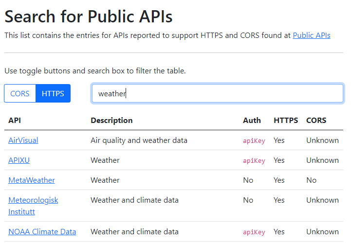

# public-api-search

This is a web page which loads the README file from [Public APIs](https://github.com/public-apis/public-apis/blob/master/README.md) and renders a table listing the APIs which may be filtered and searched using some simple controls.

You can visit the live page at <https://median-man.github.io/public-api-search/>.

## Usage

Use the toggle buttons for `CORS` and `HTTPS` to filter out APIs that are not reported to support these features to easily find APIs that will support client side AJAX requests.

You can filter the displayed results based on query by entering a search term in the input box.

Click on the star icon next to an API to add it to your favorites and use the `Favorites` toggle button to filter the table to show only APIs you have marked. Favorites are saved locally in your browser. Your saved favorites will not appear if you open the page on another browser/device.

## Bugs/Suggestions

Please feel free to open an issue if you have suggestions or wish to report a bug. Keep in mind that the data for the APIs is sourced from a third party project. If the data about an API is incorrect, head over to [Public APIs](https://github.com/public-apis/public-apis). All data for this page is sourced from the README.md file.

## Dev Tooling (Create React App)

This project was bootstrapped with [Create React App](https://github.com/facebook/create-react-app).

### Available Scripts

In the project directory, you can run:

#### `npm run fetch-data`

This script uses curl to download api data from <https://api.publicapis.org/> and writes the data to `src/data/apis.json`.

#### `npm start`

Runs the app in the development mode.\
Open [http://localhost:3000](http://localhost:3000) to view it in the browser.

The page will reload if you make edits.\
You will also see any lint errors in the console.

#### `npm test`

Launches the test runner in the interactive watch mode.\
See the section about [running tests](https://facebook.github.io/create-react-app/docs/running-tests) for more information.

#### `npm run build`

Builds the app for production to the `build` folder.\
It correctly bundles React in production mode and optimizes the build for the best performance.

The build is minified and the filenames include the hashes.\
Your app is ready to be deployed!

See the section about [deployment](https://facebook.github.io/create-react-app/docs/deployment) for more information.

#### `npm run eject`

**Note: this is a one-way operation. Once you `eject`, you can’t go back!**

If you aren’t satisfied with the build tool and configuration choices, you can `eject` at any time. This command will remove the single build dependency from your project.

Instead, it will copy all the configuration files and the transitive dependencies (webpack, Babel, ESLint, etc) right into your project so you have full control over them. All of the commands except `eject` will still work, but they will point to the copied scripts so you can tweak them. At this point you’re on your own.

You don’t have to ever use `eject`. The curated feature set is suitable for small and middle deployments, and you shouldn’t feel obligated to use this feature. However we understand that this tool wouldn’t be useful if you couldn’t customize it when you are ready for it.

### Learn More

You can learn more in the [Create React App documentation](https://facebook.github.io/create-react-app/docs/getting-started).

To learn React, check out the [React documentation](https://reactjs.org/).
